# PolicyPilot - Architecture Diagrams

This document contains Mermaid diagrams visualizing the PolicyPilot system architecture.

---

## 1. High-Level System Architecture

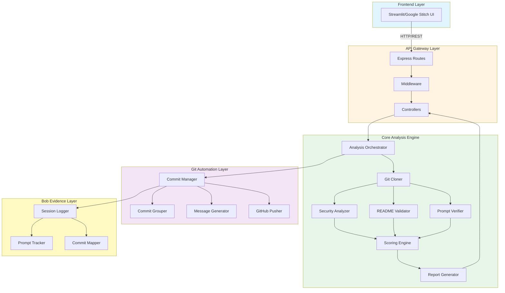

---

## 2. Analysis Pipeline Flow

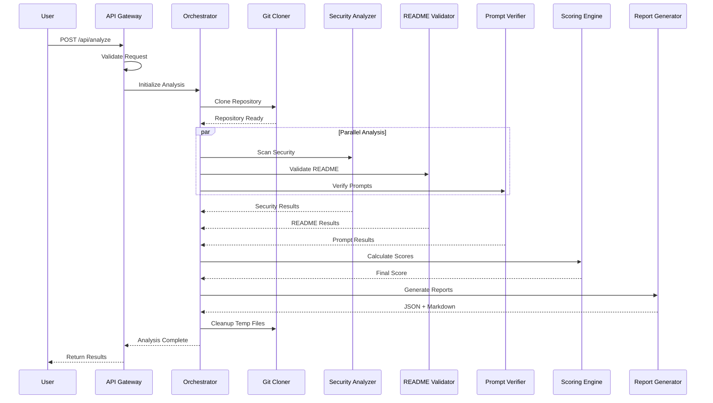

---

## 3. Git Automation Workflow

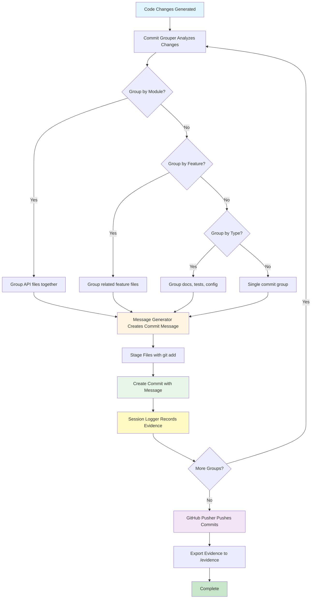

---

## 4. Module Dependency Graph

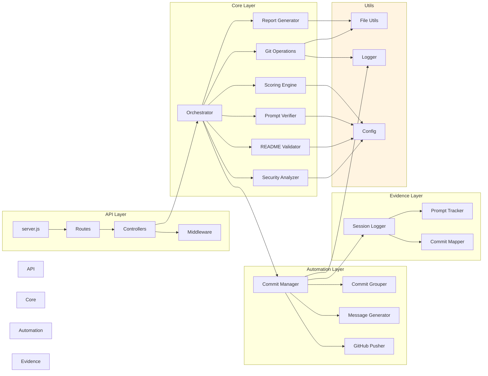

---

## 5. Data Flow Diagram

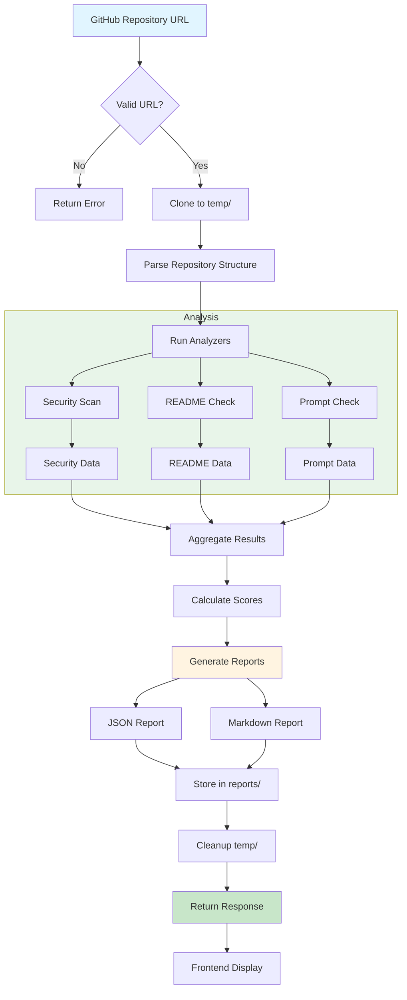

---

## 6. Scoring Algorithm Flow

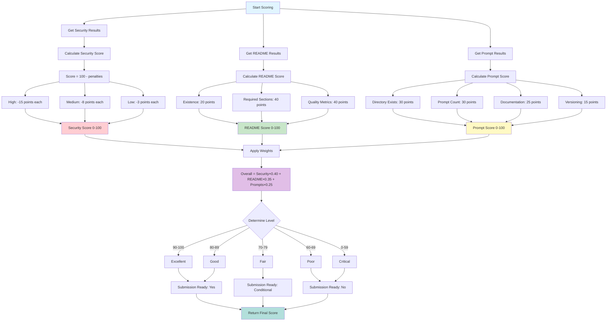

---

## 7. Commit Grouping Strategy

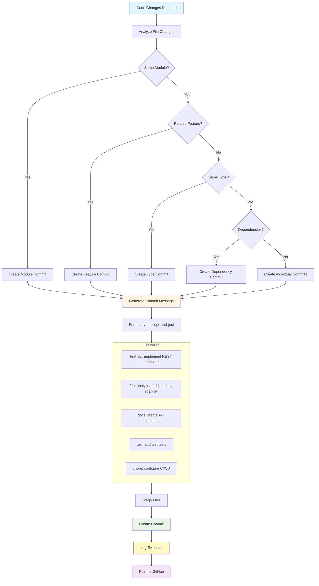

---

## 8. Bob Evidence Tracking System

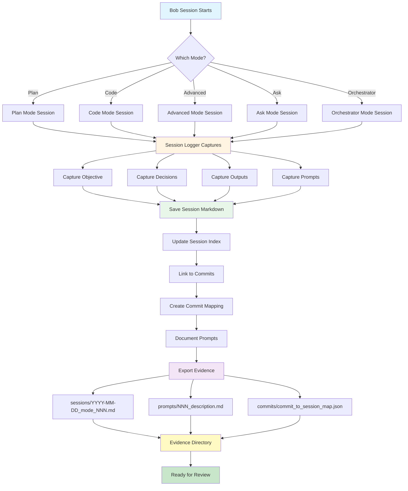

---

## 9. API Request/Response Flow

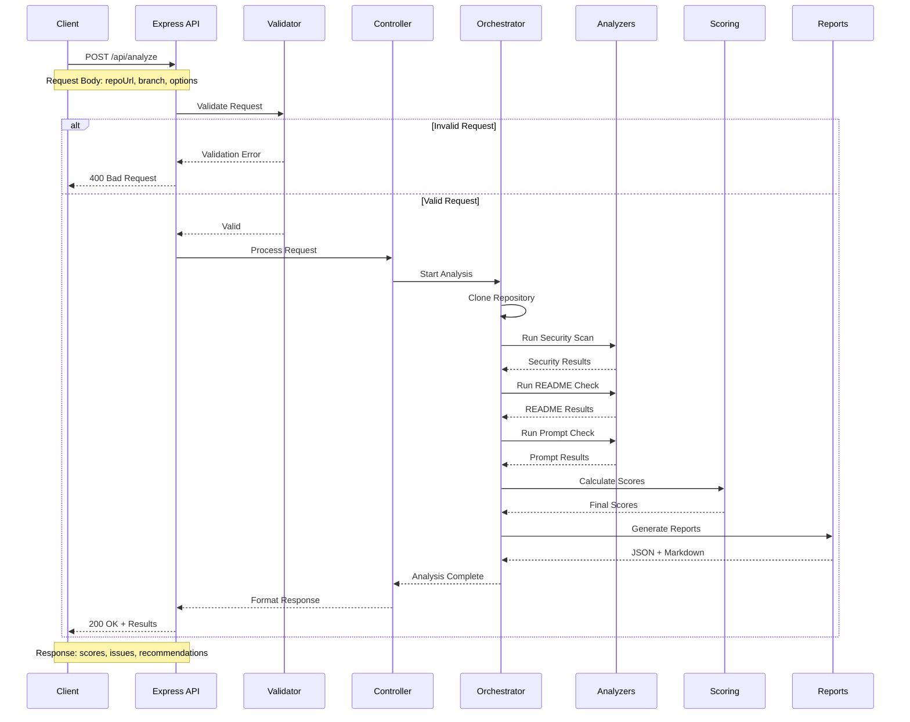

---

## 10. Deployment Architecture

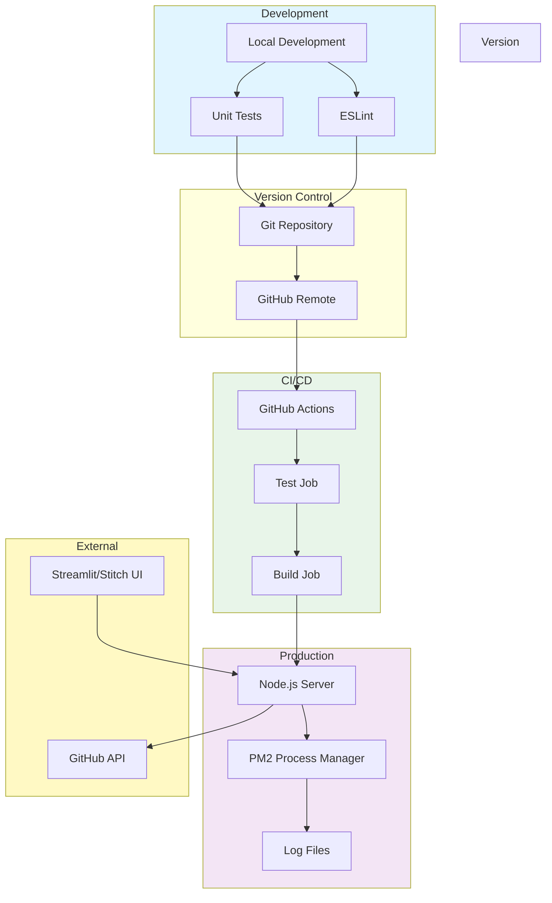

---

## 11. Security Analysis Process

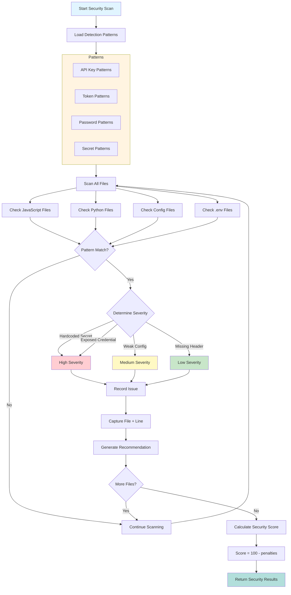

---

## 12. Implementation Phases Timeline

```mermaid
gantt
    title PolicyPilot Implementation Roadmap
    dateFormat HH:mm
    axisFormat %H:%M
    
    section Phase 1: Foundation
    Project Init           :p1, 00:00, 1h
    Express Setup          :p2, after p1, 1h
    Git Operations         :p3, after p2, 1h
    
    section Phase 2: Core Analysis
    Security Analyzer      :p4, after p3, 1.5h
    README Validator       :p5, after p4, 1h
    Prompt Verifier        :p6, after p5, 1h
    Scoring Engine         :p7, after p6, 1.5h
    
    section Phase 3: Reporting
    Report Generators      :p8, after p7, 1.5h
    Analysis Orchestrator  :p9, after p8, 1.5h
    
    section Phase 4: Automation
    Git Automation         :p10, after p9, 2h
    Bob Evidence System    :p11, after p10, 2h
    
    section Phase 5: Testing & Docs
    Unit Tests             :p12, after p11, 2h
    Documentation          :p13, after p12, 1.5h
    CI/CD Setup            :p14, after p13, 1h
```

---

*These diagrams provide visual representations of the PolicyPilot architecture, workflows, and implementation strategy.*

*Document Version: 1.0*  
*Last Updated: 2026-05-03*  
*Author: Bob (Plan Mode)*