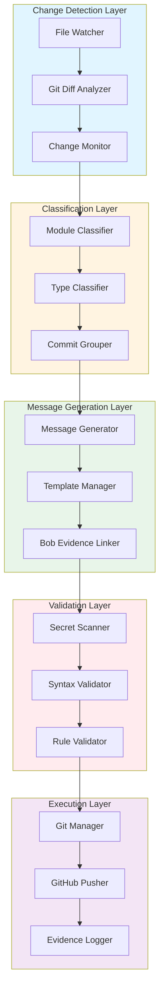
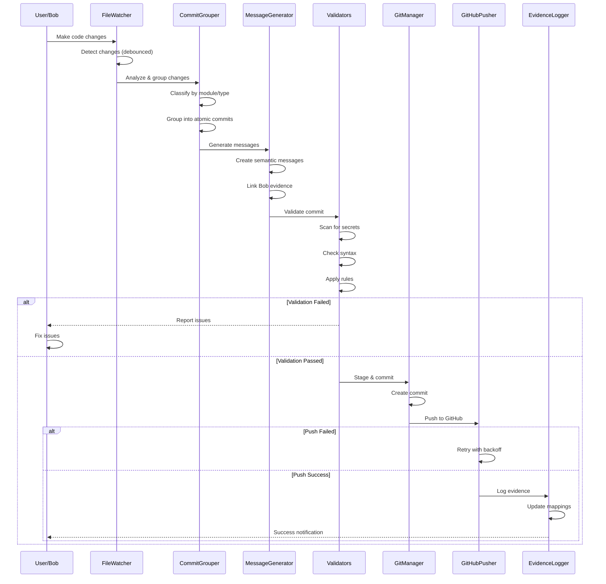
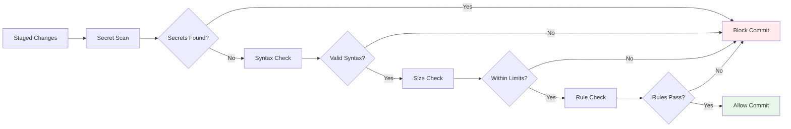

# PolicyPilot Git Automation System - Design Specification

**Version:** 1.0  
**Last Updated:** 2026-05-03  
**Author:** Bob (Plan Mode)  
**Status:** Design Complete - Ready for Implementation

---

## Table of Contents

1. [Executive Summary](#1-executive-summary)
2. [System Architecture](#2-system-architecture)
3. [Commit Classification Rules](#3-commit-classification-rules)
4. [Module-to-Commit Mapping](#4-module-to-commit-mapping)
5. [Safety Rules & Validation](#5-safety-rules--validation)
6. [Bob Evidence Integration](#6-bob-evidence-integration)
7. [GitHub Actions CI/CD](#7-github-actions-cicd)
8. [Implementation Guidelines](#8-implementation-guidelines)
9. [Configuration & Deployment](#9-configuration--deployment)
10. [Monitoring & Maintenance](#10-monitoring--maintenance)

---

## 1. EXECUTIVE SUMMARY

### 1.1 Purpose

The Git Automation System for PolicyPilot provides intelligent, context-aware commit management that:
- **Detects** file changes automatically
- **Classifies** changes by module and type
- **Generates** semantic commit messages
- **Validates** commits for safety and quality
- **Pushes** to GitHub with proper authentication
- **Tracks** Bob evidence for audit trails

### 1.2 Key Features

✅ **Intelligent Change Detection** - Monitors workspace for modifications  
✅ **Smart Commit Grouping** - Groups related changes into atomic commits  
✅ **Auto-Generated Messages** - Creates semantic commit messages from context  
✅ **Safety Validation** - Prevents accidental secret commits  
✅ **Bob Integration** - Links commits to AI session evidence  
✅ **GitHub Automation** - Automated push with retry logic  
✅ **CI/CD Pipeline** - Automated testing and deployment

### 1.3 Design Principles

1. **Atomic Commits** - Each commit is self-contained and reversible
2. **Semantic Messages** - Follow Conventional Commits specification
3. **Safety First** - Multiple validation layers prevent accidents
4. **Evidence-Based** - All commits linked to Bob sessions
5. **Automation-Ready** - Designed for CI/CD integration

---

## 2. SYSTEM ARCHITECTURE

### 2.1 Component Overview



### 2.2 Core Components

#### 2.2.1 Change Detection Layer

**FileWatcher**
- Monitors workspace directory for file changes
- Debounces rapid changes (500ms window)
- Filters out ignored files (.gitignore patterns)
- Triggers analysis on stable state

**GitDiffAnalyzer**
- Compares working directory with HEAD
- Identifies added, modified, deleted files
- Extracts line-level changes
- Provides context for classification

**ChangeMonitor**
- Aggregates changes from multiple sources
- Maintains change history
- Provides change statistics
- Triggers commit workflow

#### 2.2.2 Classification Layer

**ModuleClassifier**
- Maps files to PolicyPilot modules
- Uses directory structure patterns
- Identifies cross-module changes
- Assigns primary module per change group

**TypeClassifier**
- Determines commit type (feat, fix, docs, etc.)
- Analyzes file extensions and content
- Considers change patterns
- Applies heuristics for edge cases

**CommitGrouper**
- Groups related changes into atomic commits
- Applies grouping rules (by module, feature, type)
- Handles dependencies between changes
- Optimizes for clean git history

#### 2.2.3 Message Generation Layer

**MessageGenerator**
- Creates semantic commit messages
- Uses Conventional Commits format
- Incorporates Bob context
- Generates detailed body with bullet points

**TemplateManager**
- Manages commit message templates
- Provides module-specific templates
- Supports custom templates
- Validates template syntax

**BobEvidenceLinker**
- Links commits to Bob sessions
- Extracts session metadata
- Generates evidence references
- Maintains commit-to-session mapping

#### 2.2.4 Validation Layer

**SecretScanner**
- Scans staged changes for secrets
- Uses existing PolicyPilot secret scanner
- Blocks commits with detected secrets
- Provides remediation guidance

**SyntaxValidator**
- Validates commit message syntax
- Checks Conventional Commits format
- Enforces character limits
- Validates references and links

**RuleValidator**
- Applies custom validation rules
- Checks file patterns
- Validates commit size
- Enforces project policies

#### 2.2.5 Execution Layer

**GitManager**
- Executes git commands
- Stages files for commit
- Creates commits with messages
- Manages git state

**GitHubPusher**
- Authenticates with GitHub
- Pushes commits to remote
- Handles push failures with retry
- Manages branch operations

**EvidenceLogger**
- Logs commit metadata
- Updates evidence files
- Maintains audit trail
- Generates commit reports

### 2.3 Data Flow



---

## 3. COMMIT CLASSIFICATION RULES

### 3.1 Commit Type Classification

#### Type Detection Algorithm

```python
def classify_commit_type(files: List[Path], changes: Dict) -> CommitType:
    """
    Classify commit type based on files and changes.
    
    Priority order:
    1. Breaking changes → BREAKING
    2. New features → feat
    3. Bug fixes → fix
    4. Documentation → docs
    5. Tests → test
    6. Refactoring → refactor
    7. Style changes → style
    8. Configuration → chore
    """
    
    # Check for breaking changes
    if has_breaking_changes(changes):
        return CommitType.BREAKING
    
    # Check file patterns
    if all(is_doc_file(f) for f in files):
        return CommitType.DOCS
    
    if all(is_test_file(f) for f in files):
        return CommitType.TEST
    
    if all(is_config_file(f) for f in files):
        return CommitType.CHORE
    
    # Analyze change content
    if has_new_functionality(changes):
        return CommitType.FEAT
    
    if has_bug_fixes(changes):
        return CommitType.FIX
    
    if is_refactoring(changes):
        return CommitType.REFACTOR
    
    if is_style_only(changes):
        return CommitType.STYLE
    
    # Default to feat for new files, fix for modifications
    return CommitType.FEAT if has_new_files(files) else CommitType.FIX
```

#### Type Definitions

| Type | Description | Examples |
|------|-------------|----------|
| **feat** | New feature or enhancement | New module, new endpoint, new functionality |
| **fix** | Bug fix | Error handling, logic correction, crash fix |
| **docs** | Documentation only | README, comments, API docs, guides |
| **test** | Test additions/changes | Unit tests, integration tests, test data |
| **refactor** | Code restructuring | Rename, reorganize, optimize without behavior change |
| **style** | Code style changes | Formatting, whitespace, linting fixes |
| **chore** | Maintenance tasks | Dependencies, config, build scripts |
| **perf** | Performance improvements | Optimization, caching, algorithm improvement |
| **ci** | CI/CD changes | GitHub Actions, pipeline config |
| **build** | Build system changes | Package.json, requirements.txt, Dockerfile |
| **revert** | Revert previous commit | Undo changes |

### 3.2 Scope Classification

#### PolicyPilot Module Scopes

| Scope | Directory Pattern | Description |
|-------|------------------|-------------|
| **security** | `app/services/secret_scanner.py` | Secret scanning functionality |
| **readme** | `app/services/readme_validator.py` | README validation |
| **prompts** | `app/services/prompt_checker.py` | Prompt documentation checking |
| **scoring** | `app/services/scoring_engine.py` | Score calculation |
| **reporting** | `app/services/report_generator.py` | Report generation |
| **api** | `app/main.py`, `app/models.py` | API endpoints and models |
| **config** | `app/config.py`, `.env.example` | Configuration |
| **tests** | `test_*.py` | Test files |
| **docs** | `*.md` (root level) | Documentation |
| **ci** | `.github/workflows/` | CI/CD pipelines |
| **core** | Multiple modules | Cross-cutting changes |

### 3.3 Commit Grouping Rules

#### Rule 1: Module Cohesion
Group files from the same module into one commit

#### Rule 2: Feature Completeness
Group all files needed for a complete feature

#### Rule 3: Type Separation
Separate different types of changes

#### Rule 4: Dependency Order
Respect dependency relationships

#### Rule 5: Size Limits
Split large commits into smaller ones (max 20 files, 1000 lines)

---

## 4. MODULE-TO-COMMIT MAPPING

### 4.1 PolicyPilot Module Structure

```
backend/
├── app/
│   ├── __init__.py           → chore(setup)
│   ├── config.py             → chore(config)
│   ├── main.py               → feat(api)
│   ├── models.py             → feat(api)
│   └── services/
│       ├── secret_scanner.py → feat(security)
│       ├── readme_validator.py → feat(readme)
│       ├── prompt_checker.py → feat(prompts)
│       ├── scoring_engine.py → feat(scoring)
│       ├── report_generator.py → feat(reporting)
│       └── file_handler.py   → feat(api)
├── tests/
│   └── test_*.py             → test(module)
├── .github/workflows/        → ci(pipeline)
├── requirements.txt          → build(deps)
├── README.md                 → docs
└── *.md                      → docs
```

### 4.2 Commit Mapping Examples

#### Example 1: Secret Scanner Module

**Files:** `app/models.py`, `app/services/secret_scanner.py`, `test_secret_scanner.py`, `SECRET_SCANNER_COMMIT.md`

**Commit:** `feat(security): implement advanced secret scanning engine`

**Rationale:** All files are part of the same feature and must be committed together

#### Example 2: API Endpoint Addition

**Strategy:**
- Commit 1: `feat(api): add new analysis endpoint` (implementation)
- Commit 2: `test(api): add tests for new endpoint` (tests)
- Commit 3: `docs: document new API endpoint` (documentation)

---

## 5. SAFETY RULES & VALIDATION

### 5.1 Pre-Commit Validation Pipeline



### 5.2 Secret Detection Rules

- Scan all staged files before commit
- Block high-confidence secrets (≥0.8)
- Warn on medium-confidence secrets (0.5-0.8)
- Use PolicyPilot's existing secret scanner

### 5.3 File Pattern Rules

**Blocked Patterns:**
- `.env`, `.env.local`, `.env.production`
- `.pem`, `.key`, `.p12`, `.pfx`
- `id_rsa`, `id_dsa`
- Binary files, archives, media files

### 5.4 Commit Size Rules

- Max 20 files per commit
- Max 1000 lines added per commit
- Max 500 lines deleted per commit
- Max 1500 total changes per commit

### 5.5 Message Syntax Rules

- Follow Conventional Commits format
- Max 72 characters for subject line
- Max 100 characters per body line
- Valid types: feat, fix, docs, test, refactor, style, chore, perf, ci, build, revert

---

## 6. BOB EVIDENCE INTEGRATION

### 6.1 Evidence Structure

```
evidence/
├── sessions/
│   ├── 2026-05-03_code_session_001.md
│   └── session_index.json
├── commits/
│   ├── commit_map.json
│   └── abc123_secret_scanner.md
└── prompts/
    ├── 001_architecture_design.md
    └── prompt_index.json
```

### 6.2 Session Documentation Format

Each Bob session generates a markdown file with:
- Session metadata (ID, mode, date, duration, objective)
- Context and key decisions
- Implementation details
- Files modified
- Commits generated
- Testing results
- Next steps

### 6.3 Commit-to-Session Mapping

JSON file tracking:
- Commit hash and metadata
- Session information
- Files changed with statistics
- Validation results
- Related prompts and tags

### 6.4 Evidence in Commit Messages

```
feat(security): implement advanced secret scanning engine

Add comprehensive secret detection with entropy analysis

Features:
- Multi-pattern detection for 20+ secret types
- Shannon entropy calculation
- Confidence scoring system

Evidence: evidence/sessions/2026-05-03_code_session_002.md
Session: code_002
Generated-by: Bob AI Assistant
```

---

## 7. GITHUB ACTIONS CI/CD

### 7.1 Workflow Jobs

1. **Code Quality** - Black, isort, Flake8, MyPy, Pylint
2. **Security Scan** - Secret scanner, Bandit
3. **Unit Tests** - Pytest with coverage (Python 3.10, 3.11, 3.12)
4. **Integration Tests** - API endpoint testing
5. **Build & Package** - Python package build
6. **Docker Build** - Container image creation
7. **Deploy** - Staging and production deployment

### 7.2 Trigger Conditions

- **Push:** main, develop, feature/* branches
- **Pull Request:** main, develop branches
- **Manual:** workflow_dispatch with environment selection

### 7.3 Required Secrets

- `DOCKER_USERNAME` - Docker Hub username
- `DOCKER_PASSWORD` - Docker Hub password
- `DEPLOY_KEY` - Deployment credentials
- `GITHUB_TOKEN` - Automatic (provided by GitHub)

---

## 8. IMPLEMENTATION GUIDELINES

### 8.1 Development Workflow

1. **Make Changes** - Develop features in workspace
2. **Auto-Detection** - File watcher detects changes
3. **Review Grouping** - System proposes commit groups
4. **Approve/Modify** - User reviews and approves
5. **Validation** - Automated safety checks
6. **Commit** - Create commits with generated messages
7. **Push** - Automated push to GitHub
8. **Evidence** - Log session and commit evidence

### 8.2 Configuration Files

**`.gitautomation.yml`**
```yaml
version: "1.0"

detection:
  debounce_ms: 500
  watch_patterns:
    - "**/*.py"
    - "**/*.md"
    - "**/*.json"
    - "**/*.yml"
  ignore_patterns:
    - "**/__pycache__/**"
    - "**/venv/**"
    - "**/node_modules/**"

classification:
  max_files_per_commit: 20
  max_lines_per_commit: 1000
  group_by_module: true
  group_by_feature: true

validation:
  scan_secrets: true
  check_syntax: true
  enforce_size_limits: true
  block_on_high_confidence_secrets: true
  warn_on_medium_confidence_secrets: true

evidence:
  enabled: true
  session_dir: "evidence/sessions"
  commit_dir: "evidence/commits"
  prompt_dir: "evidence/prompts"

github:
  auto_push: true
  retry_attempts: 3
  retry_delay_seconds: 2
  default_branch: "main"
```

### 8.3 CLI Commands

```bash
# Initialize git automation
git-auto init

# Start watching for changes
git-auto watch

# Manual commit with auto-grouping
git-auto commit

# Review pending changes
git-auto status

# Generate evidence report
git-auto evidence

# Push to GitHub
git-auto push

# Configure settings
git-auto config set validation.scan_secrets true
```

---

## 9. CONFIGURATION & DEPLOYMENT

### 9.1 Installation

```bash
# Install dependencies
pip install -r requirements.txt

# Install git automation tool
pip install git-automation-tool

# Initialize in project
cd /path/to/policypilot
git-auto init
```

### 9.2 Environment Variables

```bash
# GitHub authentication
GITHUB_TOKEN=ghp_your_token_here

# Git configuration
GIT_AUTHOR_NAME="Bob AI Assistant"
GIT_AUTHOR_EMAIL="bob@policypilot.ai"

# Evidence tracking
EVIDENCE_DIR="evidence"
SESSION_TRACKING=true

# Validation settings
SCAN_SECRETS=true
BLOCK_HIGH_CONFIDENCE=true
```

### 9.3 Integration with Bob

Bob modes automatically trigger git automation:
- **Plan Mode:** Creates architecture commits
- **Code Mode:** Creates feature/fix commits
- **Test Mode:** Creates test commits
- **Docs Mode:** Creates documentation commits

---

## 10. MONITORING & MAINTENANCE

### 10.1 Metrics to Track

- Commits per day/week
- Average commit size
- Validation failure rate
- Secret detection rate
- Push success rate
- Evidence coverage

### 10.2 Maintenance Tasks

- Review and update commit templates monthly
- Audit evidence mappings quarterly
- Update secret patterns as needed
- Review and optimize grouping rules
- Monitor CI/CD pipeline performance

### 10.3 Troubleshooting

**Issue:** Commits blocked by secret scanner
**Solution:** Review detected secrets, update .gitignore, use environment variables

**Issue:** Commit message validation fails
**Solution:** Check Conventional Commits format, adjust message length

**Issue:** Push failures
**Solution:** Verify GitHub token, check network connectivity, review branch permissions

---

## CONCLUSION

This Git Automation System provides PolicyPilot with:

✅ **Intelligent commit management** with automatic detection and grouping  
✅ **Safety-first validation** preventing accidental secret commits  
✅ **Complete audit trail** through Bob evidence integration  
✅ **Automated CI/CD** with comprehensive testing  
✅ **Clean git history** with semantic commit messages  

**Next Steps:**
1. Review this design specification
2. Approve architecture and rules
3. Switch to Code mode for implementation
4. Begin with core components (detection, classification)
5. Add validation and execution layers
6. Integrate with Bob evidence system
7. Deploy GitHub Actions workflows

---

**Document Version:** 1.0  
**Last Updated:** 2026-05-03  
**Author:** Bob (Plan Mode)  
**Status:** ✅ Design Complete - Ready for Implementation