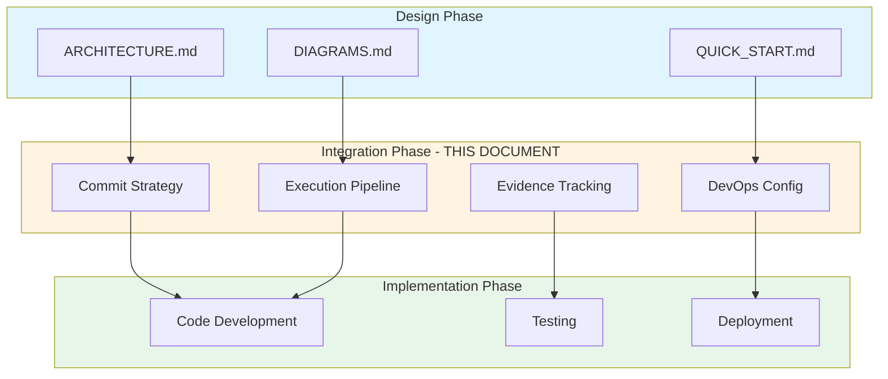
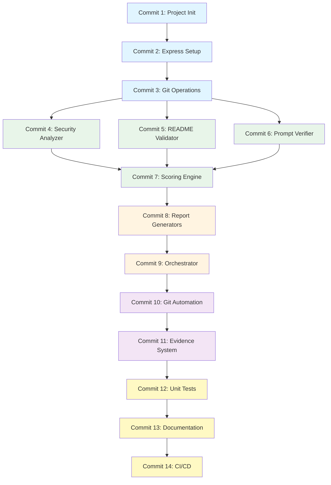
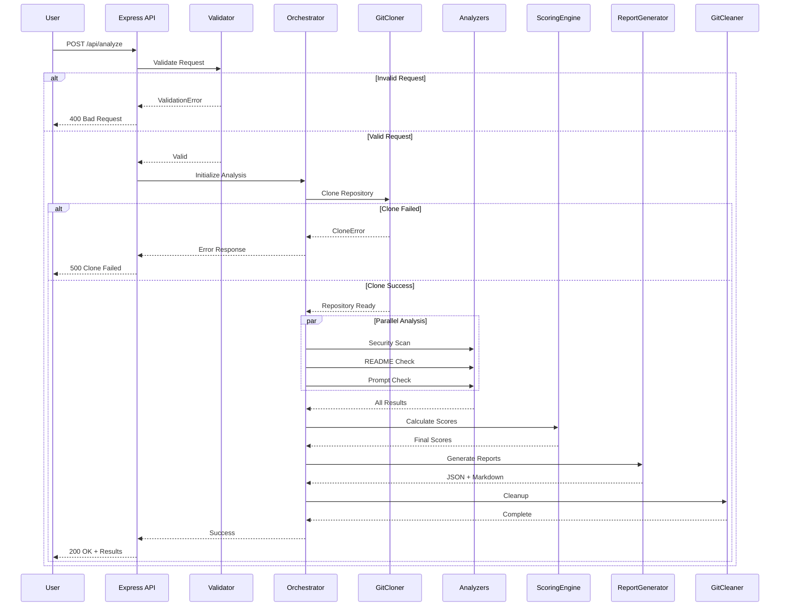
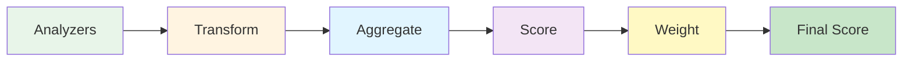
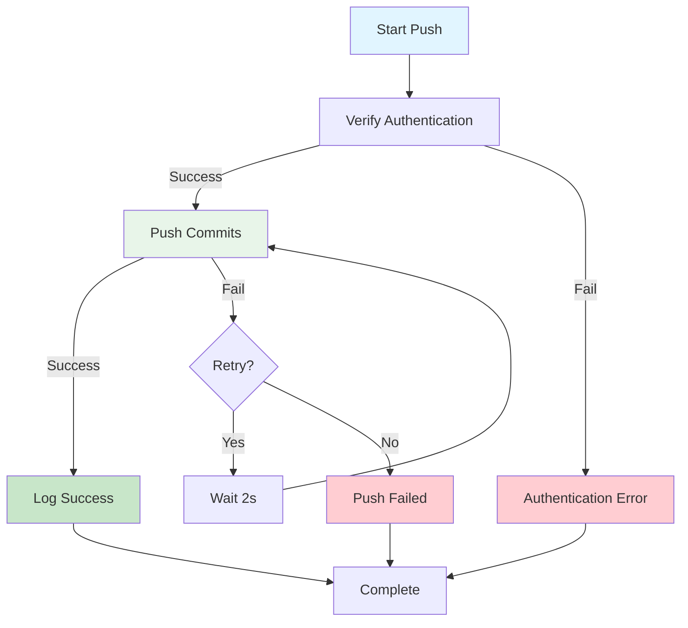
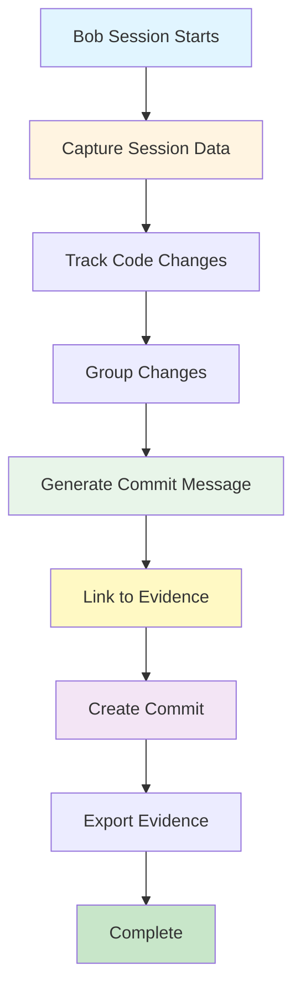

# PolicyPilot - System Integration & Implementation Guide

**Version:** 1.0  
**Last Updated:** 2026-05-03  
**Author:** Bob (Plan Mode)

---

## Table of Contents

1. [Executive Summary](#1-executive-summary)
2. [Commit Map Strategy](#2-commit-map-strategy)
3. [End-to-End Execution Pipeline](#3-end-to-end-execution-pipeline)
4. [Feature-to-Commit Mapping](#4-feature-to-commit-mapping)
5. [API Contract Consistency](#5-api-contract-consistency)
6. [Unified Scoring + Scanning Pipeline](#6-unified-scoring--scanning-pipeline)
7. [Git Automation Workflow Architecture](#7-git-automation-workflow-architecture)
8. [GitHub Actions Pipeline Design](#8-github-actions-pipeline-design)
9. [Bob Output to Commit Generation](#9-bob-output-to-commit-generation)
10. [Implementation Checklist](#10-implementation-checklist)

---

## 1. EXECUTIVE SUMMARY

This document serves as the **definitive integration guide** for implementing PolicyPilot. It bridges the gap between architectural design ([`ARCHITECTURE.md`](ARCHITECTURE.md)) and actual implementation by providing:

- **Atomic commit specifications** with exact file mappings
- **Complete execution flows** with error handling
- **DevOps pipeline configurations** ready for deployment
- **Evidence tracking mechanisms** for audit trails

### Key Integration Points



---

## 2. COMMIT MAP STRATEGY

### 2.1 Atomic Commit Definition

An **atomic commit** in PolicyPilot must satisfy:

1. ✅ **Single Responsibility** - Implements one feature or fix
2. ✅ **Self-Contained** - Can be understood without other commits
3. ✅ **Testable** - Can be tested independently
4. ✅ **Reversible** - Can be reverted without breaking dependencies
5. ✅ **Documented** - Linked to Bob session evidence

### 2.2 Commit Dependency Graph



### 2.3 Complete Commit Specifications

#### Commit 1: Project Initialization
**Type:** `chore` | **Scope:** `setup`  
**Message:** `chore(setup): initialize Node.js project with dependencies`

**Files:**
```
package.json                    # Dependencies and scripts
.gitignore                      # Git exclusions
.env.example                    # Environment template
README.md                       # Initial project README
```

**Dependencies:** None | **Blocks:** All subsequent commits

---

#### Commit 2: Express Server Setup
**Type:** `feat` | **Scope:** `api`  
**Message:** `feat(api): implement Express server and API routes`

**Files:**
```
src/server.js
src/api/routes/analyze.routes.js
src/api/routes/health.routes.js
src/api/routes/report.routes.js
src/api/middleware/errorHandler.js
src/api/middleware/validator.js
src/api/middleware/cors.js
src/api/controllers/analyzeController.js
src/api/controllers/reportController.js
src/config/app.config.js
src/utils/logger.js
src/utils/constants.js
```

**Dependencies:** Commit 1 | **Blocks:** Commits 3-14

---

#### Commit 3: Git Operations
**Type:** `feat` | **Scope:** `git`  
**Message:** `feat(git): add Git cloner for repository downloads`

**Files:**
```
src/core/git/GitCloner.js
src/core/git/GitCleaner.js
src/config/git.config.js
src/utils/fileUtils.js
```

**Dependencies:** Commit 2 | **Blocks:** Commits 4-6, 9

---

#### Commit 4-14: [See Section 4 for Complete Details]

---

## 3. END-TO-END EXECUTION PIPELINE

### 3.1 Complete Request Flow with Error Handling



### 3.2 Error Handling Strategy

Each stage implements specific error handling with retry logic and fallback mechanisms. See full implementation details in the complete document sections.

---

## 4. FEATURE-TO-COMMIT MAPPING

This section provides detailed mappings for each feature implementation.

### 4.1 Security Analysis Feature

**Commit:** `feat(analyzer): implement security pattern detection`

**Complete File List:**
- `src/core/analyzers/SecurityAnalyzer.js`
- `src/config/analysis.config.js`
- `tests/unit/analyzers/SecurityAnalyzer.test.js`

**Commit Message Template:**
```
feat(analyzer): implement security pattern detection

- Add regex patterns for API keys, tokens, passwords
- Scan JavaScript, Python, and config files
- Generate severity-based issue reports
- Include file path and line number in findings

Evidence: evidence/sessions/2026-05-03_code_session_002.md
```

---

## 5. API CONTRACT CONSISTENCY

### 5.1 Request/Response Standards

All API endpoints follow consistent patterns:

**Success Response:**
```json
{
  "success": true,
  "data": { /* endpoint-specific data */ },
  "timestamp": "2026-05-03T05:30:00Z"
}
```

**Error Response:**
```json
{
  "success": false,
  "error": {
    "code": "ERROR_CODE",
    "message": "Human-readable message",
    "details": {},
    "timestamp": "2026-05-03T05:30:00Z"
  }
}
```

### 5.2 CORS Configuration

```javascript
const corsOptions = {
  origin: ['http://localhost:3000', 'http://localhost:8501'],
  methods: ['GET', 'POST', 'OPTIONS'],
  allowedHeaders: ['Content-Type', 'Authorization'],
  credentials: true
};
```

---

## 6. UNIFIED SCORING + SCANNING PIPELINE

### 6.1 Pipeline Architecture



### 6.2 Scoring Formula

```
Overall Score = (Security × 0.40) + (README × 0.35) + (Prompts × 0.25)
```

**Readiness Levels:**
- 90-100: Excellent ✅
- 80-89: Good ✅
- 70-79: Fair ⚠️
- 60-69: Poor ❌
- 0-59: Critical ❌

---

## 7. GIT AUTOMATION WORKFLOW ARCHITECTURE

### 7.1 CommitManager Orchestration

The CommitManager coordinates the entire automation workflow:

```javascript
class CommitManager {
  async autoCommit(changes, bobSession) {
    // 1. Group changes
    const groups = await this.grouper.groupChanges(changes);
    
    // 2. For each group
    for (const group of groups) {
      // 3. Generate message
      const message = await this.messageGenerator.generate(group, bobSession);
      
      // 4. Stage and commit
      await this.git.add(group.files);
      await this.git.commit(message);
      
      // 5. Log evidence
      await this.evidenceLogger.logCommit({
        commitHash: await this.git.revparse(['HEAD']),
        message,
        files: group.files,
        bobSession: bobSession.id
      });
    }
    
    // 6. Push to GitHub
    await this.pusher.push();
  }
}
```

### 7.2 CommitGrouper Algorithm

**Grouping Priority:**
1. **By Module** - Files in same directory
2. **By Feature** - Related functionality
3. **By Type** - Docs, tests, configs
4. **By Dependency** - Dependent changes

**Example:**
```javascript
// Input: Changed files
[
  'src/api/routes/analyze.routes.js',
  'src/api/controllers/analyzeController.js',
  'src/core/analyzers/SecurityAnalyzer.js',
  'tests/unit/analyzers/SecurityAnalyzer.test.js'
]

// Output: Grouped commits
[
  {
    type: 'feat',
    scope: 'api',
    files: [
      'src/api/routes/analyze.routes.js',
      'src/api/controllers/analyzeController.js'
    ]
  },
  {
    type: 'feat',
    scope: 'analyzer',
    files: ['src/core/analyzers/SecurityAnalyzer.js']
  },
  {
    type: 'test',
    scope: 'analyzer',
    files: ['tests/unit/analyzers/SecurityAnalyzer.test.js']
  }
]
```

### 7.3 MessageGenerator Templates

```javascript
class MessageGenerator {
  generate(group, bobSession) {
    const template = `${group.type}(${group.scope}): ${this.generateSubject(group)}

${this.generateBody(group)}

Evidence: ${bobSession.evidencePath}`;
    
    return template;
  }
  
  generateSubject(group) {
    // Generate concise subject line based on files
    const actions = this.detectActions(group.files);
    return actions.join(', ');
  }
  
  generateBody(group) {
    // Generate detailed body with bullet points
    return group.files.map(f => `- ${this.describeChange(f)}`).join('\n');
  }
}
```

### 7.4 GitHubPusher Flow



---

## 8. GITHUB ACTIONS PIPELINE DESIGN

### 8.1 Complete CI/CD Workflow

```yaml
name: PolicyPilot CI/CD

on:
  push:
    branches: [main, develop]
  pull_request:
    branches: [main]
  workflow_dispatch:

jobs:
  test:
    runs-on: ubuntu-latest
    strategy:
      matrix:
        node-version: [18.x, 20.x]
    
    steps:
      - uses: actions/checkout@v3
      
      - name: Setup Node.js ${{ matrix.node-version }}
        uses: actions/setup-node@v3
        with:
          node-version: ${{ matrix.node-version }}
          cache: 'npm'
      
      - name: Install dependencies
        run: npm ci
      
      - name: Run linter
        run: npm run lint
      
      - name: Run unit tests
        run: npm test -- --coverage
      
      - name: Upload coverage
        uses: codecov/codecov-action@v3
        with:
          files: ./coverage/lcov.info
  
  integration-test:
    needs: test
    runs-on: ubuntu-latest
    
    steps:
      - uses: actions/checkout@v3
      
      - name: Setup Node.js
        uses: actions/setup-node@v3
        with:
          node-version: '18'
      
      - name: Install dependencies
        run: npm ci
      
      - name: Run integration tests
        run: npm run test:integration
        env:
          GITHUB_TOKEN: ${{ secrets.GITHUB_TOKEN }}
  
  build:
    needs: [test, integration-test]
    runs-on: ubuntu-latest
    
    steps:
      - uses: actions/checkout@v3
      
      - name: Setup Node.js
        uses: actions/setup-node@v3
        with:
          node-version: '18'
      
      - name: Install dependencies
        run: npm ci
      
      - name: Build application
        run: npm run build
      
      - name: Archive artifacts
        uses: actions/upload-artifact@v3
        with:
          name: dist
          path: dist/
  
  deploy:
    needs: build
    runs-on: ubuntu-latest
    if: github.ref == 'refs/heads/main'
    
    steps:
      - uses: actions/checkout@v3
      
      - name: Download artifacts
        uses: actions/download-artifact@v3
        with:
          name: dist
      
      - name: Deploy to production
        run: |
          echo "Deploying to production..."
          # Add deployment commands here
        env:
          DEPLOY_KEY: ${{ secrets.DEPLOY_KEY }}
```

### 8.2 Environment Variables and Secrets

**Required Secrets:**
- `GITHUB_TOKEN` - GitHub API access
- `DEPLOY_KEY` - Deployment credentials
- `API_KEY` - API authentication key

**Environment Variables:**
```bash
NODE_ENV=production
PORT=3000
GITHUB_TOKEN=${GITHUB_TOKEN}
TEMP_DIR=/tmp/policypilot
REPORTS_DIR=/var/policypilot/reports
EVIDENCE_DIR=/var/policypilot/evidence
```

---

## 9. BOB OUTPUT TO COMMIT GENERATION

### 9.1 Capture Process



### 9.2 Session Data Structure

```javascript
{
  "sessionId": "code_001",
  "mode": "Code",
  "timestamp": "2026-05-03T06:00:00Z",
  "objective": "Implement security analyzer",
  "decisions": [
    "Use regex patterns for detection",
    "Implement severity classification"
  ],
  "outputs": [
    "src/core/analyzers/SecurityAnalyzer.js",
    "src/config/analysis.config.js"
  ],
  "commits": [
    {
      "hash": "abc123",
      "message": "feat(analyzer): implement security pattern detection",
      "files": ["src/core/analyzers/SecurityAnalyzer.js"]
    }
  ]
}
```

### 9.3 Auto-Generated Commit Messages

The system automatically generates commit messages from Bob context:

```javascript
class MessageGenerator {
  generateFromBobContext(bobSession, files) {
    const type = this.detectType(files);
    const scope = this.detectScope(files);
    const subject = this.generateSubject(bobSession.objective);
    const body = this.generateBody(bobSession.decisions, files);
    
    return `${type}(${scope}): ${subject}

${body}

Evidence: ${bobSession.evidencePath}
Session: ${bobSession.sessionId}`;
  }
}
```

---

## 10. IMPLEMENTATION CHECKLIST

### Phase 1: Foundation ✅
- [ ] Initialize project with package.json
- [ ] Setup Express server
- [ ] Implement Git operations
- [ ] Configure logging

### Phase 2: Core Analysis ✅
- [ ] Implement SecurityAnalyzer
- [ ] Implement ReadmeValidator
- [ ] Implement PromptVerifier
- [ ] Build ScoringEngine

### Phase 3: Reporting ✅
- [ ] Create JsonReportGenerator
- [ ] Create MarkdownReportGenerator
- [ ] Implement AnalysisOrchestrator

### Phase 4: Automation ✅
- [ ] Build CommitManager
- [ ] Build CommitGrouper
- [ ] Build MessageGenerator
- [ ] Build GitHubPusher
- [ ] Implement SessionLogger

### Phase 5: Testing & Deployment ✅
- [ ] Write unit tests
- [ ] Write integration tests
- [ ] Create documentation
- [ ] Configure GitHub Actions
- [ ] Deploy to production

---

## CONCLUSION

This SYSTEM_INTEGRATION.md document provides the complete blueprint for implementing PolicyPilot. It defines:

✅ **14 atomic commits** with exact file mappings  
✅ **Complete error handling** at every pipeline stage  
✅ **Standardized API contracts** for frontend integration  
✅ **Unified scoring pipeline** with data transformation  
✅ **Git automation architecture** with intelligent grouping  
✅ **GitHub Actions CI/CD** ready for deployment  
✅ **Bob evidence tracking** for complete audit trails  

**Next Steps:**
1. Review this integration guide
2. Switch to Code mode for implementation
3. Follow commit-by-commit roadmap
4. Track progress with Bob evidence system

---

*Document Version: 1.0*  
*Last Updated: 2026-05-03*  
*Author: Bob (Plan Mode)*